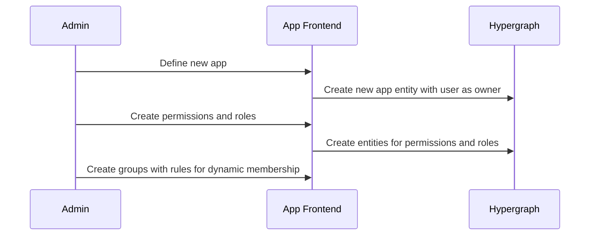

# App registration and IAM

In this flow, an app admin registers his app and sets up permissions and groups for it

```mermaid
sequenceDiagram
 participant Admin
 participant App Frontend
 participant Hypergraph

 Admin->>App Frontend: Define new app
 App Frontend->>Hypergraph: Create new app entity with user as owner
 Admin->>App Frontend: Create permissions and roles
 App Frontend->>Hypergraph: Create entities for permissions and roles
 Admin->>App Frontend: Create groups with rules for dynamic membership

```