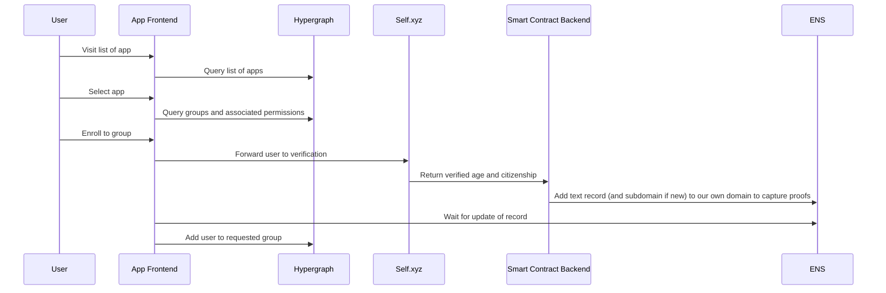

# User enrollment

In this flow, a prospective user browses apps and decides to enroll as user

```mermaid
sequenceDiagram
 participant User
 participant App Frontend
 participant Hypergraph
 participant Self.xyz
 participant Smart Contract Backend
 participant ENS

 User->>App Frontend: Visit list of app
 App Frontend->>Hypergraph: Query list of apps
 User->>App Frontend: Select app
 App Frontend->>Hypergraph: Query groups and associated permissions
 User->>App Frontend: Enroll to group
 App Frontend->>Self.xyz: Forward user to verification
 Self.xyz->>Smart Contract Backend: Return verified age and citizenship
 Smart Contract Backend->>ENS: Add text record (and subdomain if new) to our own domain to capture proofs
 App Frontend->>ENS: Wait for update of record
 App Frontend->>Hypergraph: Add user to requested group
```