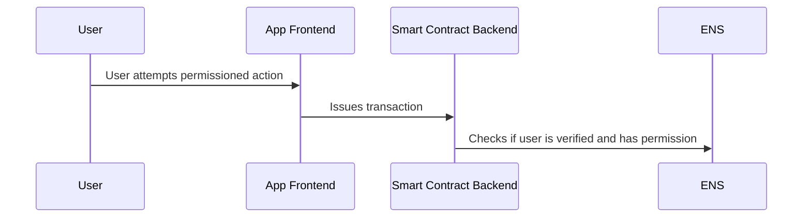

# App usage

In this flow, a user authorizes using I'm Graph.

```mermaid
sequenceDiagram
 participant User
 participant App Frontend
 participant Smart Contract Backend
 participant ENS

 User->>App Frontend: User attempts permissioned action
 App Frontend->>Smart Contract Backend: Issues transaction
 Smart Contract Backend->>ENS: Checks if user is verified and has permission
```