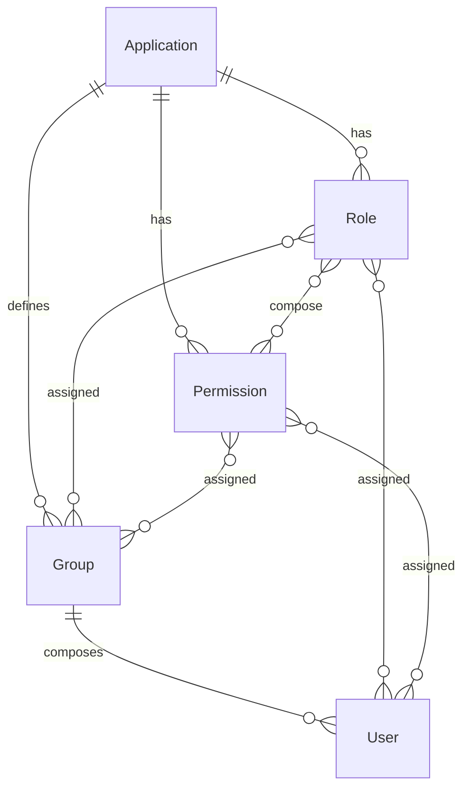

# Graph Model

These types are created in Hypergraph.

```mermaid
erDiagram
  Application
  Permission
  Role
  Group
  User

  Application ||--o{ Permission: has
  Application ||--o{ Role: has
  Application ||--o{ Group: defines

  Group ||--o{ User: composes

  Role }o--o{ Permission: compose

  Role }o--o{ Group: assigned
  Role }o--o{ User: assigned
  Permission }o--o{ Group: assigned
  Permission }o--o{ User: assigned


```